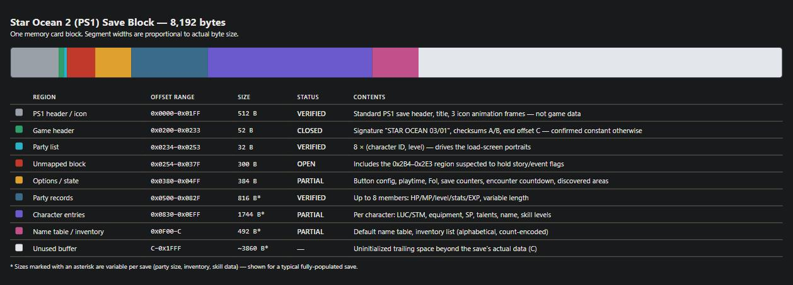

# Star Ocean: The Second Story (PS1, US) — Save Format Reference

Everything below was reverse-engineered directly from real save files and the game's own screens —
no published spec exists for this format. Every field is tagged with how confident we are in it.



## Status tags

| Tag | Meaning |
|---|---|
| **VERIFIED** | Matched against a number the game displayed, or a controlled before/after diff of a real in-game save |
| **LIKELY** | Fits every sample seen, but not directly confirmed by the game |
| **OPEN** | Located but not understood, or not located at all — do not write to it |

## Layout at a glance

One memory card block is **8,192 bytes**. `q` below means "the start of a given character's HP block
inside the party records"; `name` means "the start of that character's name string inside the character
entries." Both vary per save — they're found by scanning, not fixed offsets.

| Offset | Field |
|---|---|
| `0x0000–0x01FF` | PS1 save header, title, 3 icon animation frames (not game data) |
| `0x0200` | Game data starts — ASCII signature `STAR OCEAN 03/01` |
| `0x0210` u16 | Checksum A |
| `0x0214` u32 | Checksum B |
| `0x021A` u16 | `C` — end-of-data offset |
| `0x0234–0x0253` | Party list: 8 × (u16 character ID, u16 level) — **this drives the load-screen portrait**, independent of the party record itself |
| `0x0380–0x04FF` | Options and misc. state (see table below) |
| `0x0500–0x082F` | Party records — up to 8 members, variable length, in party order |
| `0x0830–0x0EFF` | Character entries — one per character, variable length |
| `0x0EEC–0x0F67` | Default name table (shared, not per-save) |
| `C`–`0x1FFF` | Trailing buffer — uninitialized, not real data |

### Checksums (recompute after any edit)

```
zero A and B
B = sum of bytes [4, C) as u32
A = sum of bytes [0x206, 0x281) as u16   (this range includes B's own bytes — B must be computed first)
```
Implemented as `so2_sign()` in `saveconv.py`.

## The 12 character IDs

| ID | Character | ID | Character |
|---|---|---|---|
| 1 | Hero slot (Claude or Rena, by route) | 7 | Ashton |
| 2 | The other lead (Rena or Claude) | 8 | Leon |
| 3 | Celine | 9 | Opera |
| 4 | Bowman | 10 | Ernest |
| 5 | Dias | 11 | Noel |
| 6 | Precis | 12 | Chisato |

Route exclusivity (enforced by story scripts, not the save file): Leon is Claude-route only, Dias is
Rena-route only; Ashton excludes Opera and Ernest; Precis excludes Bowman; Chisato needs a free slot.
The save's own string for Claude is literally `Crawd` (both in his name entry and the default name table).

## Party record (per member, offsets from `q`)

Each record is preceded by a variable-length header: `<class> <ID> 00 00 00 ...`, where `<class>` is
`01`/`03`/`05`/`09` depending on the character, and `<ID>` selects the sprite/name/portrait — **VERIFIED**,
changing the ID byte turns the record into a different character.

| Offset | Size | Field | Status |
|---|---|---|---|
| `q-4` | u32 | EXP (cap 999,999,999) | VERIFIED |
| `q+0, +5, +10` | u16 ×3 | HP (three copies), cap 9999 | VERIFIED |
| `q+15, +17, +19` | u16 ×3 | MP (three copies), cap 999 | VERIFIED |
| `q+21, +23` | u16 ×2 | Level (two copies), cap 255 | VERIFIED |
| `q+25` | u16 ×3 | STR | VERIFIED |
| `q+31` | u16 ×3 | CON | VERIFIED |
| `q+37` | u16 ×3 | AGL | VERIFIED |
| `q+43` | u16 ×3 | DEX | VERIFIED |
| `q+49` | u16 ×3 | INT | VERIFIED |
| `q+55, +57` | u16 ×2 | Unknown pair | OPEN |
| `q+59` | u16 | GUTS | VERIFIED |

Stats can exceed 999 naturally (a level-255 STR of 1467 was observed). 999 is proven safe to write; 9999
was tried once as part of a larger batched edit that corrupted the save, so the true cap is **not proven**
— don't assume 9999 is safe on its own. ATK/AC/HIT/AVD/MAG are computed by the game, not stored.
Precis's record is one byte shorter after HP (every later offset shifts by −1).

## Character entry (relative to `name`, the start of the character's name string)

### Extended stats

| Field | Layout | Status |
|---|---|---|
| LUC | u16 ×3: (base, base, effective) | VERIFIED |
| STM | u16 ×3: (base, base, effective) | VERIFIED |

"Effective" is what the Status screen shows (includes equipment). Both sit roughly 25–40 bytes before
`name`; writing here blind is unsafe — locate them by walking backward from the SP block instead.

### Talent mask

One u16 bitmask, immediately before the SP block:

| Entry ends in | Mask offset |
|---|---|
| `... 00 01` (class-1) | `name - 4` |
| `... 00 00 00` (class-0) | `name - 5` |

| Bit | Talent | Bit | Talent |
|---|---|---|---|
| 0 | Originality | 5 | Sense of Rhythm |
| 1 | Sense of Taste | 6 | Pitch |
| 2 | Dexterity | 7 | Love of Animals |
| 3 | Sense of Design | 8 | Sixth Sense |
| 4 | Writing Ability | 9 | The Blessing of Mana (normally unobtainable in play) |

`0x3FF` = all ten. **VERIFIED** on all 16 tested character-slots across both classes; a fixed-width u16
write in place, no length shift. Gaining a talent normally also awards 100 SP — writing the mask directly
does not award that SP.

### SP (skill points to spend) — variable-width block

SP is **not** a fixed 2-byte field. It's a variable-width block that the game itself resizes as SP
crosses 0 and 256:

```
zero  (SP = 0)     :  00 00 <marker>                                    no SP bytes at all
small (SP 1-255)   :  00 00 <prefix> <SP u8> 00 00 <marker=0x03>
large (SP >= 256)  :  00 00 <prefix> <SP u8 lo> <SP u8 hi> 00 00 <marker=0x02>   (+1 byte vs. small)
```
followed by `<talent mask u16>` then the trailer (`00 00 00` for class-0, `00 01` for class-1) then `name`.

| Form | SP u16 location |
|---|---|
| Class-1 large (Claude, Opera, Ernest, Ashton, Dias, Bowman, Precis, Chisato ≥256) | `name - 9` |
| Class-0 large (Rena, Celine, Leon, Noel) | `name - 10` |

**Rules, all VERIFIED in-game:**
- small → large: replace `[prefix, lo, 00, 00, 0x03]` with `[prefix, lo, hi, 00, 00, 0x02]` (**+1 byte**, `C += 1`)
- zero → value: **replace** the marker byte in place with `[prefix, SP bytes, 00, 00, marker]` — do **not** cut or insert around the existing `00 00` before it
- the game switches form by itself as SP crosses 0/256 — only ever convert a form the game has actually written for that character; if unsure, trigger one real level-up first and read what it wrote
- prefix byte is character/slot-specific and must be preserved as-is (values seen: `0x02`, `0x05`, `0x0A`, others)
- zero-form marker byte is also character/slot-specific (values seen: Leon `0x08`, Bowman `0x04`, Noel `0x0B`, Chisato `0x10`)

Tool: `so2_refill_sp.py` implements this for all 12 characters, all forms, both classes.

### Equipment

Two known layouts, both immediately before the SP block:

**Full (7 slots, no marker)** — the common case:
```
[weapon][armor][shield][helmet][greaves][acc1][acc2]   <- ends right at the SP block
```

**Compressed (6 slots, missing one item) — one accessory slot absent:**
```
[acc1][weapon][armor][shield][helmet][greaves]  00 00 <prefix>   <- then the SP block
```
Confirmed for Celine, Leon, Noel (in the save where he's missing accessory 2), Precis. Reordering
(accessory1 moves to the front) plus 2 bytes, not just a shorter version of the 7-slot block.

The trailing `00 00 <prefix>` is **not a special equipment marker** — it's just the SP block's own
leading bytes (see the SP section above), sitting with no separator right after the item list. The
byte is whatever that character's personal SP prefix happens to be (`0x02` for most, but `0x05` for
Noel in some saves, `0x0A` for Chisato). An earlier version of this code only recognized literal
`0x02`, which silently misread any character with a different prefix as a full 7-slot entry — fixed,
detection is now `d[sp0-3:sp0-1] == 00 00` regardless of the third byte.

| Status | Detail |
|---|---|
| VERIFIED | Full 7-slot layout; the 6-slot missing-accessory-2 layout above; Noel in both saves (full 7 slots in the current Game 2 save — confirmed against the user's real equip screen: Serpent's Tooth / Valiant Mail / Rare Gauntlets / Banded Helm / Bunny Shoe / Tri-emblem ×2, exact match) |
| OPEN | Chisato's equipment: she's missing **armor**, not an accessory — the 6-slot recipe above does not generalize to this case, order not solved. Needs her real equipped Shield/Helmet/Greaves/Acc1/Acc2 (not a compatibility list) from her Equipment overview screen — blind item-ID pattern matching in the raw bytes has repeatedly produced false-positive noise and is not reliable evidence on its own |

Tool: `so2_equip.py`. Item ID table: `item_ids.txt` (save ID = published CodeBreaker code − `0x5000`).

**Weapon type per character** (use to sanity-check any decoded weapon — a mismatch means the read is wrong):

| Type | Characters |
|---|---|
| Sword | Claude, Dias |
| Dual-Sword | Ashton |
| Knuckles | Bowman, Rena, Noel |
| Kaleidoscope | Opera |
| Whip | Ernest |
| Book | Leon |
| Staff/Rod | Celine |
| Hand | Precis |
| Gun | Chisato |

Universal items that appear on multiple different-type characters' lists (don't use these to infer
type): All-Purpose Knife, Funny Slayer, Million Staff, Weird Slayer.

### Name

ASCII, no terminator, followed by `00 00`, followed by one byte = `20 - len(name)`. A different-length
name shifts every following byte and changes `C` — rename in-game rather than by hand.

### Skill levels

46 consecutive bytes after the name and a 33-byte flag run (purpose of the flag run: OPEN), one byte per
skill, `0`–`10` (10 = maxed). **VERIFIED** on all 16 tested character-slots.

| # | Skill | # | Skill | # | Skill | # | Skill |
|---|---|---|---|---|---|---|---|
| 0 | Sketching | 12 | Danger Sense | 24 | Piety | 36 | Feint |
| 1 | Musical Notation | 13 | Biology | 25 | Playfulness | 37 | Mental Training |
| 2 | Music Instrument | 14 | Mental Science | 26 | Functionality | 38 | Motormouth |
| 3 | Tool Knowledge | 15 | Kitchen Knife | 27 | Courage | 39 | Body Control |
| 4 | Mineralogy | 16 | Recipe | 28 | Poker Face | 40 | Spirit Force |
| 5 | Herbal Medicine | 17 | Good Eye | 29 | Copying | 41 | Parry |
| 6 | Craft | 18 | Whistling | 30 | Mech Knowledge | 42 | Cancel |
| 7 | Esthetic Sense | 19 | Animal Training | 31 | Mech Operation | 43 | Gale |
| 8 | Writing | 20 | Metal Casting | 32 | Below the Belt | 44 | Provocation |
| 9 | Effort | 21 | Scientific Ability | 33 | Strong Blow | 45 | Float |
| 10 | Perseverance | 22 | Fairyology | 34 | Flip | | |
| 11 | Patience | 23 | Radar | 35 | Counterattack | | |

## Inventory

Variable-length list at roughly `0x0C00`–`0x0EB6`, sorted alphabetically by item name (ignoring spaces/
punctuation), one u16 little-endian entry per owned item:

```
entry = (count << 10) | item_id      # count in the top 6 bits, item ID in the low 10 bits
```

- Max stack is **20** for every item, weapon, armor and accessory.
- Editing the count of an item you already own is a safe in-place u16 write, no length shift.
- Removing an item (count → 0) deletes its 2-byte entry and leaves a 3-byte tombstone (`00 00 <xx>`).
- **OPEN**: hand-inserting a brand-new item type (one you don't already own) is not solved — two attempts
  both corrupted the save. The reliable path is to obtain the item through real play once, then use the
  count-edit tool. The save format appears to do real sorting/compaction on save rather than a raw
  memory dump, so a hand-spliced entry is missing something the game recomputes at that moment.

## Options / misc. state (`0x0380`–`0x04FF`)

| Offset | Field | Status |
|---|---|---|
| `0x0382` / `0x0384` / `0x0386` / `0x0388` | u16 button codes: confirm / cancel / menu / move (`0x40` X, `0x20` Circle, `0x10` Triangle, `0x80` Square) | VERIFIED |
| `0x021C` / `0x0392` | u16 playtime in minutes (two copies) | VERIFIED |
| `0x0220` | u8, save counter (increments every save) | VERIFIED |
| `0x0254` | u8, a second independent save counter | VERIFIED |
| `0x039C` | 3 bytes, Fol (money), little-endian | VERIFIED |
| `0x04EC` | u16(?), counts down — likely steps-until-next-random-encounter | LIKELY |
| `0x0280`–`0x0290` | Grows in small bursts per save — likely tied to the "discovered areas" list | LIKELY |
| `0x0380` | Changes unpredictably — likely an RNG seed | LIKELY |

## Known open items (not mapped)

- **Story/event flags** — the strongest untouched lead: a ~48-byte block at `0x02B4`–`0x02E3`, all-zero
  early game, densely set late game. Needs a save immediately before/after one discrete story beat to
  isolate the first bits that flip.
- **Map/location** — no live coordinate found. Entering genuinely new territory grows a variable-length
  "discovered areas" list; plain movement across already-explored ground shows no signal.
- **The 33-byte flag run** inside each character entry, just before the skill levels.
- **Private Actions / emotion levels, item-creation recipes** — not located.
- A separate 9-slot "Special Attack/Magic" list, distinct from the 46 proficiency skills — not mapped to the save file.
- A checksum-A discrepancy on saves from before the second protagonist joins the party (low priority — no reason to edit saves that early).
